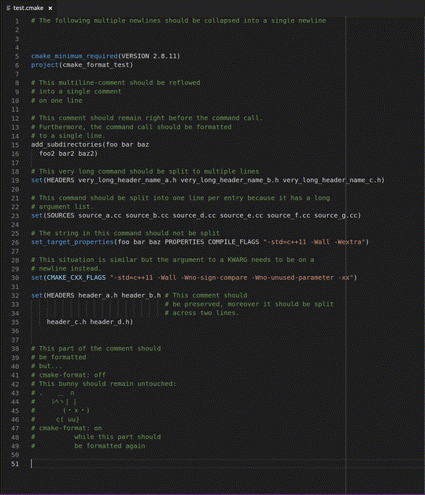

# cmake-format

`cmake-format` can format your listfiles nicely so that they don't look like
crap.

## Features

The `cmake-format` extension for vscode provides a document format
command for listfiles. The extension is quite limited in scope to just this
one feature. I may grow it in the future to provide more language support
features for cmake.

Source for this extension is maintained with the source for `cmake-format` in
[github][1].

## Requirements

In order for this extension to work you must have `cmake-format` installed.
The recommended way to do that is through `pip`, e.g.
`pip install cmake_format`.

## Extension Settings

This extension contributes the following settings:

* `cmakeFormat.exePath`: Path to `cmake-format` executable.
* `cmakeFormat.cwd`: The working directory for the `cmake-format` subprocess
* `cmakeFormat.env`: Environment variables to be set for the subprocess call,
  use this to configure any `PATH` or `PYTHONPATH` modifications.
* `cmakeFormat.mergeEnv`: If true (default) then environment variables specified
  in `cmakeFormat.env` will be merged with those of the current environment
  to create the environment for the subprocess call.
* `cmakeFormat.args`: Additional command line arguments to be specified. For
  instance use `["--config-file", "<path/to/.cmake-format.py>"]` to specify
  a custom configuration.

## Known Issues

You can find known issues with `cmake-format` on [github][3].
Feel free to file issues with the vscode extension there as well.

[1]: https://github.com/cheshirekow/cmake_format
[3]: https://github.com/cheshirekow/cmake_format/issues
